# Simulador de Triagem Pré-Hospitalar

Simulador de treino em que o formando regista os sinais vitais e os sinais/sintomas de uma vítima fictícia, livremente ou passo a passo pela abordagem ABCDE, e um motor de pontuação sugere as situações clínicas mais compatíveis, com a atuação recomendada.

**[Abrir a versão online →](https://rolimjeferson26-cyber.github.io/simulador-triagem/)**

[](https://rolimjeferson26-cyber.github.io/simulador-triagem/)
[](LICENSE)

> [!WARNING]
> **Uso exclusivamente educativo.** Este simulador destina-se a sala de aula e formação. Não substitui a formação certificada nem os protocolos oficiais em vigor, e **não deve ser usado para apoio a decisão clínica em ocorrência real**.

---

## Sobre o projeto

Na formação de socorristas e bombeiros, treinar o raciocínio de triagem (olhar para um conjunto de achados e chegar à hipótese mais provável) depende muito de haver um formador disponível e de cenários preparados à mão. Este simulador dá ao formando um sítio para praticar esse raciocínio sozinho ou em aula, com casos de treino, gabarito e uma explicação de *porque* uma hipótese ficou à frente de outra.

É pensado para:
- **formandos e bombeiros**, que querem praticar a avaliação de vítimas fora de uma ocorrência real;
- **formadores**, que podem criar os seus próprios casos, ver o gabarito e comparar a resposta do formando com o esperado.

Criei este projeto a partir da minha experiência como Bombeiro EIP, para ter uma ferramenta de treino que refletisse a forma como a avaliação é feita no terreno. O conteúdo clínico foi organizado e revisto por mim, e a pontuação foi afinada com casos de teste até o ranking fazer sentido do ponto de vista operacional. É também o projeto onde junto as duas áreas em que trabalho: a emergência pré-hospitalar e o desenvolvimento de software.

## Capturas de ecrã

| | Desktop | Telemóvel |
|---|---|---|
| **Ecrã inicial** |  |  |
| **Lista de casos** |  |  |
| **Avaliação a meio** |  |  |
| **Resultado da triagem** |  |  |
| **Parâmetros Vitais (5 anos)** |  |  |
| **Avaliação ABCDE: início** | 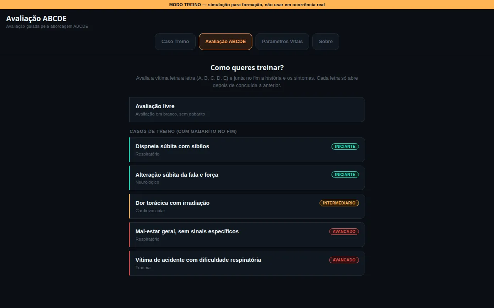 | 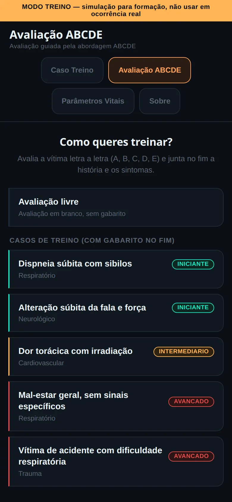 |
| **Avaliação ABCDE: letra B** | 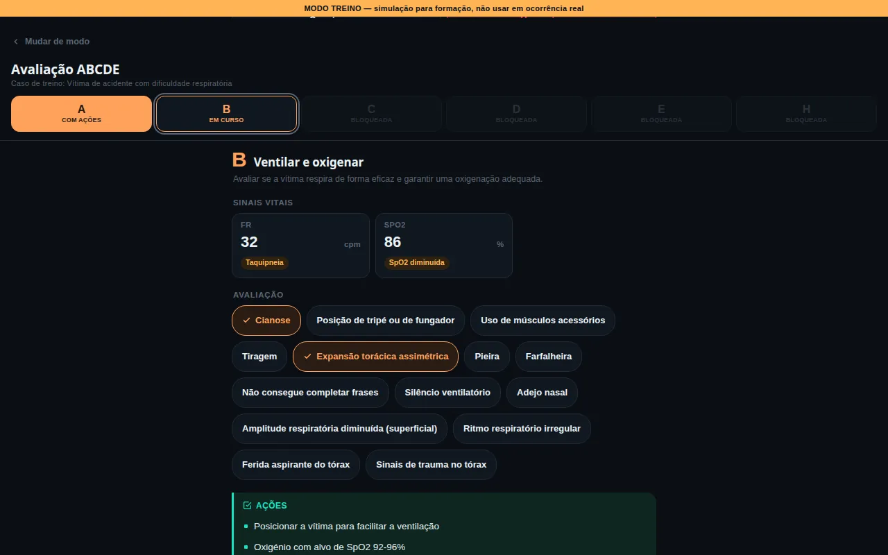 | 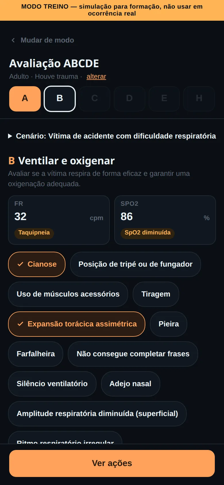 |
| **Avaliação ABCDE: ações da letra** | 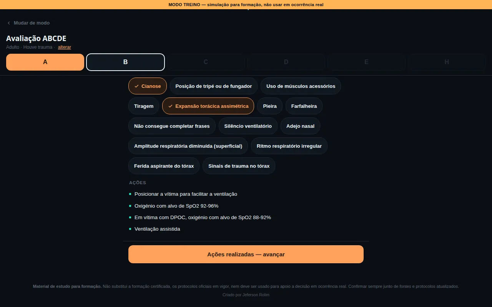 | 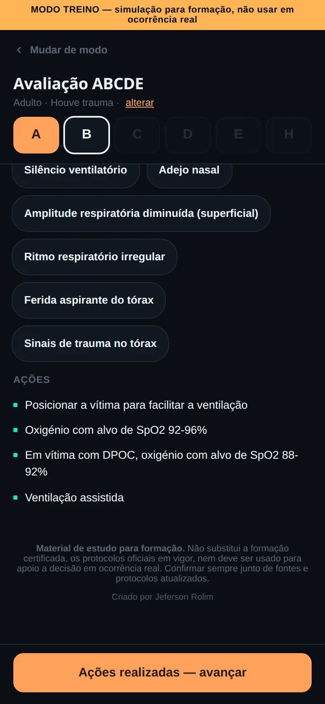 |
| **Avaliação ABCDE: história e sintomas** | 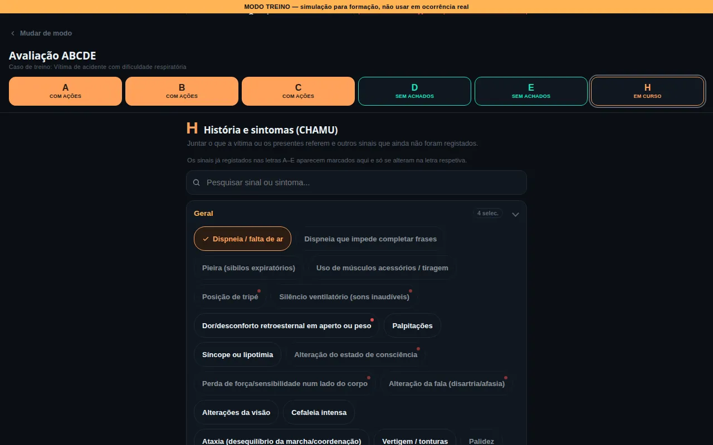 | 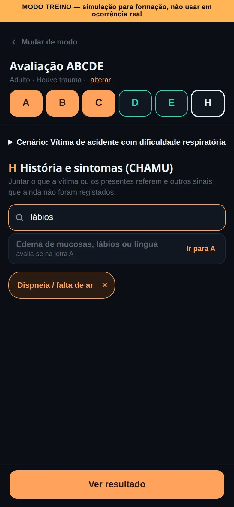 |
| **Avaliação ABCDE: resultado** | 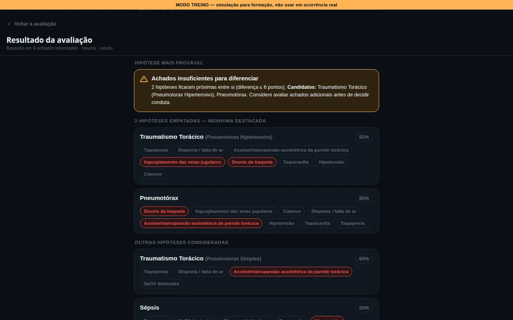 | 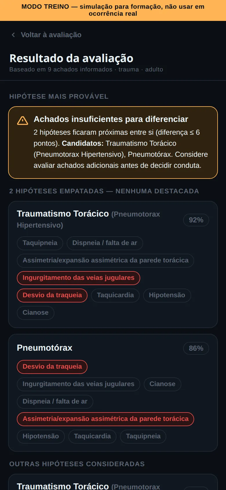 |
| **Avaliação ABCDE: comparação com o gabarito** | 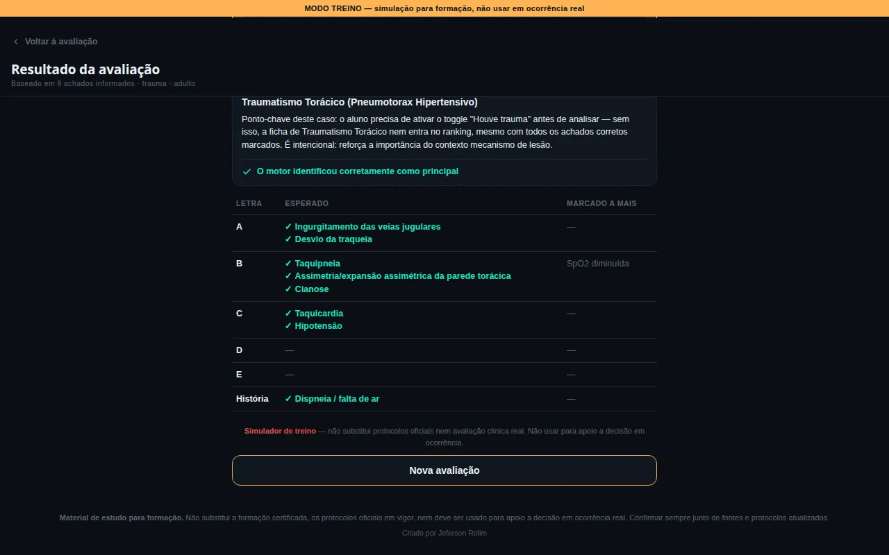 | 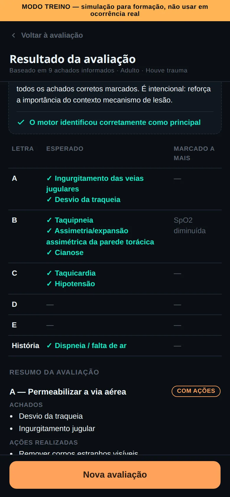 |

## Funcionalidades

**Caso Treino**
- **5 casos de treino incluídos** (2 de nível iniciante, 1 intermédio e 2 avançados, um deles propositadamente ambíguo), cada um com cenário escrito e gabarito.
- **Caso livre:** permite avaliar uma vítima sem cenário pré-definido.
- **Registo de 8 sinais vitais** (FC, FR, PAS, PAD, SpO2, temperatura, glicemia e Glasgow). Cada valor é traduzido de imediato num achado (por exemplo, "Taquicardia"), para o formando ver como o valor foi interpretado.
- **107 sinais e sintomas** organizados por grupos, com pesquisa sem acentos e destaque para os achados de alta relevância clínica.
- **Contexto da vítima:** os interruptores "trauma / sem trauma" e "adulto / pediátrico" decidem que fichas entram na análise.
- **Idade da vítima pediátrica:** no modo pediátrico, a idade (anos e meses) é obrigatória. Os sinais vitais passam a ser avaliados com os limites do grupo etário do INEM, e o resultado indica o grupo usado (por exemplo, "Sinais vitais avaliados para: 1-12 meses (INEM)").
- **Resultado com ranking** de até 4 hipóteses. Cada uma mostra a percentagem de compatibilidade, os achados que bateram e a indicação de bandeiras vermelhas.
- **Aviso de empate:** quando as hipóteses estão demasiado próximas, o simulador não escolhe uma e diz que faltam achados para diferenciar.
- **Atuação recomendada** para a hipótese destacada, com 47 planos de atuação, um por ficha.

**Modo instrutor**
- **Ver gabarito e preencher o formulário com os dados esperados** de cada caso.
- **Comparação automática** entre o resultado do motor e o gabarito do caso.
- **Editor de casos:** permite criar casos com resposta definida ou ambíguos (com vários candidatos válidos), e indicar a idade da vítima nos casos pediátricos.
- **Exportar e importar** os casos criados em ficheiro JSON, para os partilhar entre computadores.

**Avaliação ABCDE**
- **Avaliação guiada letra a letra:** A (via aérea), B (ventilação e oxigenação), C (circulação), D (função neurológica) e E (outras lesões e temperatura). Cada letra só abre depois de concluída a anterior.
- **Achados para selecionar em cada letra** (53 no total), os campos numéricos dessa letra e, no D, o estado de consciência em AVDS. Um sinal vital fora dos limites conta como achado e aparece como aviso no campo.
- **Ações no fim de cada letra:** sem achados, o botão "Nada encontrado" conclui a letra. Com achados, aparecem todas as ações da letra, e a letra só fica concluída depois de marcar "Ações realizadas".
- **Indicador de progresso** (A B C D E e história), com o estado de cada letra: bloqueada, em curso, concluída sem achados ou concluída com ações. Pode-se voltar a uma letra concluída. Se algo mudar, essa letra reabre e tem de ser concluída outra vez, e as seguintes mantêm os dados.
- **Etapa final "História e sintomas (CHAMU)"**, com o seletor completo de sinais e sintomas. Os sinais já marcados nas letras aparecem aí marcados, sem contar duas vezes.
- **Resultado:** resumo por letra (achados e ações realizadas) e o mesmo ranking e explicação do Caso Treino.
- **Dois modos:** avaliação livre, ou um dos casos de treino com cenário. No fim, o caso mostra a comparação com o gabarito: o diagnóstico e, por letra, os achados esperados vs. os marcados, com destaque para as letras onde havia achados e foi escolhido "Nada encontrado".

**Parâmetros Vitais**
- **Pesquisa por idade (anos + meses)** que devolve a faixa de referência correspondente: peso, FC, FR, TA, SpO2, glicemia e temperatura. São 12 faixas, do recém-nascido ao adulto.

## Como funciona o motor de pontuação

O motor está em [`motor_pontuacao.py`](motor_pontuacao.py) e foi replicado em JavaScript em [`motor.js`](motor.js), com as mesmas constantes e a mesma lógica. O `motor.js` é partilhado pelo Caso Treino e pela Avaliação ABCDE e corre no browser. O script Python serve para testar e afinar o motor, e um teste automático confirma que as duas versões dão os mesmos resultados.

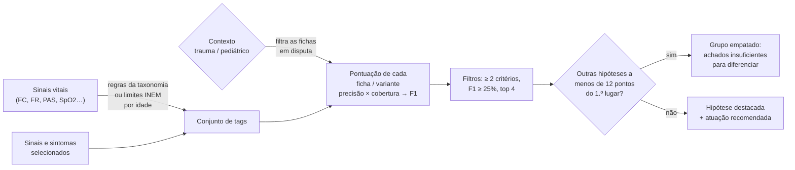

### 1. Dos dados da vítima às tags
Tudo o que o motor compara é uma **tag** (por exemplo, `dispneia`, `taquicardia`). Os sinais e sintomas já são tags. Os sinais vitais são convertidos pelas regras de [`taxonomia.json`](taxonomia.json), que tem 14 regras para 8 parâmetros. Cada regra tem um mínimo e/ou um máximo: FC ≥ 101 bpm ativa `taquicardia`, SpO2 abaixo do limite ativa `spo2_baixo`, e assim por diante. Estas são as regras de adulto. Em vítimas pediátricas, algumas são substituídas pelos limites do grupo etário (ver o ponto 7).

### 2. Cada ficha tem critérios com peso
Em [`criterios.json`](criterios.json) há **47 fichas** em 10 categorias. Cada critério é uma tag com **peso de 1 a 3**. Algumas fichas dividem-se em variantes que disputam o ranking como se fossem fichas separadas:
- 33 fichas simples;
- 7 divididas **por gravidade** (ex.: asma ligeira / moderada / grave);
- 7 divididas **por subtipo** (ex.: as lesões do trauma torácico, as síndromes tóxicas).

No total entram na disputa **79 variantes**.

### 3. Porquê F1 e não uma percentagem simples
Uma percentagem do tipo "quantos critérios desta ficha bateram" favorece fichas com poucos critérios. O motor calcula duas métricas e combina-as:

- **Precisão:** do peso total dos critérios da ficha, quanto bateu. Responde à pergunta: "o que a vítima apresenta é compatível com esta ficha?"
- **Cobertura:** das tags que o formando registou, quantas a ficha explica. Responde à pergunta: "esta ficha dá conta de tudo o que foi observado?"
- **F1:** a média harmónica das duas, `2 × P × C / (P + C)`. Só é alta quando as duas métricas são altas.

Exemplo real, o caso da captura de ecrã acima, com 7 tags: `dispneia`, `pieira`, `tiragem_musculos_acessorios`, `ansiedade`, `taquicardia`, `taquipneia`, `spo2_baixo`.

| Variante | Precisão | Cobertura | F1 |
|---|---|---|---|
| Asma — crise moderada | 83% | 100% | **91%** |
| Asma — crise grave | 53% | 86% | 65% |
| Asma — crise ligeira | 100% | 29% | 44% |

A crise ligeira bate 100% dos seus critérios, mas só explica 2 das 7 tags registadas. Com uma percentagem simples ficaria em primeiro lugar. Com F1, fica em terceiro.

### 4. Bónus das bandeiras vermelhas
Os critérios marcados como `bandeira_vermelha` (65 no total) têm o peso **multiplicado por 2** (`BONUS_BANDEIRA = 2`). Assim, um sinal de gravidade pesa mais na precisão do que um achado comum, e a sua ausência também penaliza mais.

### 5. Portões de contexto
As fichas da categoria **Trauma** só entram na disputa com mecanismo de trauma confirmado, e as de **Pediatria** só com vítima pediátrica. Sem estes portões, sinais genéricos de choque (taquicardia, palidez) punham, por exemplo, um hemotórax a competir com quadros puramente clínicos.

### 6. Limiar de diferenciação
Depois de ordenar por F1, o motor descarta as variantes com menos de 2 critérios batidos ou F1 abaixo de 25%, e fica com as 4 melhores. Se alguma estiver a **menos de 12 pontos percentuais** do 1.º lugar (`LIMIAR_DIFERENCIACAO_PONTOS = 12`), nenhuma é destacada: o resultado mostra o grupo empatado e sugere investigar mais achados antes de decidir a conduta.

### 7. Sinais vitais em vítimas pediátricas
Abaixo dos 18 anos (216 meses), a FC, a FR e a PAS são avaliadas com os **limites de alerta do INEM** para o grupo etário da vítima. Estes limites estão guardados no bloco `limites_alerta_inem` de [`parametros_vitais.json`](parametros_vitais.json) e são usados só pelo motor.

| Grupo (INEM) | Idade | FC normal | FR máx. | PAS mínima |
|---|---|---|---|---|
| Recém-nascido | < 1 mês | 100–180 | 60 | 60 |
| 1-12 meses | 1–11 meses | 80–180 | 40 | 70 |
| 1-5 anos | 12–71 meses | 70–140 | 40 | 70 + 2 × anos completos |
| 6-10 anos | 72–131 meses | 60–120 | 30 | 70 + 2 × anos completos |
| > 10 anos | 132–215 meses | 60–100 | 18 | 90 |

- **Taquicardia** com FC > máximo, **bradicardia** com FC < mínimo, **taquipneia** com FR > máximo, **hipotensão** com PAS < PAS mínima. O valor do próprio limite ainda é aceitável.
- **SpO2 ≤ 93, Glasgow ≤ 8, glicemia, temperatura e apneia** usam as mesmas regras que nos adultos.
- **A PAD e a hipertensão sistólica não ativam tags** abaixo dos 18 anos.
- A partir dos 18 anos, ou sem idade indicada, aplicam-se as regras de adulto sem nenhuma alteração.

Exemplo: um bebé de 6 meses com FC 140, FR 30 e PAS 80 está dentro dos limites do grupo "1-12 meses" e não gera nenhuma tag. Com as regras de adulto gerava taquicardia, taquipneia e hipotensão.

**Decisões registadas:**
- **Fonte:** todos os limites pediátricos vêm do manual INEM "TAS – Emergências Pediátricas" (2024), e não da tabela de 12 faixas mostrada na página de consulta. Em várias faixas, essa tabela tem valores de FR e FC que diferem do INEM.
- **Recém-nascido:** usa-se 60, o valor mais alto do intervalo 50-60 indicado pelo INEM.
- **Dos 1 aos 10 anos:** a PAS mínima é calculada com os anos completos (por exemplo, 4 anos e 11 meses → 78).
- **SpO2:** mantém-se ≤ 93 nas crianças, por ser a regra mais sensível.
- **FR mínima:** fica guardada (`fr_min`), mas só será usada quando existir a tag `bradipneia`.

## Arquitetura e tecnologias

- **HTML, CSS e JavaScript puros**, sem frameworks, sem dependências e sem passo de build.
- **Dados em JSON:** taxonomia, critérios, atuações, casos, parâmetros vitais e avaliação ABCDE.
- **Código partilhado entre páginas:** o motor (`motor.js`), os componentes de interface (`ui.js`), os estilos (`simulador.css`) e os dados (`dados.js`) existem uma só vez e são usados pelo Caso Treino e pela Avaliação ABCDE.
- **Python 3** (só a biblioteca padrão) para o motor de pontuação e os testes automatizados. O teste de paridade com o motor JavaScript usa também o **Node.js**.
- **GitHub Pages** para a publicação.

```
simulador-triagem/
├── index.html               # Caso Treino
├── abcde.html               # Avaliação ABCDE
├── parametros_vitais.html   # Pesquisa de parâmetros vitais por idade
├── motor.js                 # Motor de pontuação em JS (partilhado)
├── ui.js                    # Componentes de interface partilhados (sinais vitais, chips, resultado)
├── dados.js                 # Gerado a partir dos JSON (não editar à mão)
├── estilo.css               # Estilos base de todas as páginas
├── simulador.css            # Estilos partilhados pelo Caso Treino e pela Avaliação ABCDE
├── taxonomia.json           # Tags: 107 sinais/sintomas + 14 regras de sinais vitais
├── criterios.json           # 47 fichas com critérios, pesos e bandeiras vermelhas
├── atuacoes.json            # Atuação recomendada para cada uma das 47 fichas
├── casos_ficticios.json     # 5 casos de treino com cenário e gabarito
├── parametros_vitais.json   # 12 faixas de referência + limites de alerta pediátricos (INEM)
├── abcde.json               # Letras A–E: achados, tags, sinais vitais, ações e objetivos
├── motor_pontuacao.py       # Motor de pontuação em Python + 4 cenários de exemplo
├── demo_score_teste.py      # Versão inicial do motor, com a amostra de teste
├── taxonomia_teste.json     # Amostra inicial (4 fichas) usada pelo demo
├── criterios_teste.json     #   "
├── ferramentas/             # gerar_dados_js.py: gera o dados.js a partir dos JSON
├── tests/                   # Testes automatizados (motor, dados, ABCDE, paridade Python ↔ JS)
├── docs/screenshots/        # Capturas de ecrã deste README
├── wireframe/               # Protótipos de design (não usados pela aplicação)
└── LICENSE                  # Licença MIT
```

As páginas carregam os dados com `<script src="dados.js">`. O `dados.js` é gerado a partir dos ficheiros JSON, que continuam a ser a fonte (e que o motor em Python lê diretamente). O `parametros_vitais.html` vai buscar o `parametros_vitais.json` com `fetch`.

### Atualizar os dados

Depois de editar qualquer ficheiro JSON, gera de novo o `dados.js` e faz commit dele juntamente com o JSON (o GitHub Pages não corre scripts):

```bash
python3 ferramentas/gerar_dados_js.py
```

Se te esqueceres, o `test_dados.py` falha e indica o comando.

## Como executar localmente

```bash
git clone https://github.com/rolimjeferson26-cyber/simulador-triagem.git
cd simulador-triagem
python3 -m http.server 8000
```

Depois abre <http://localhost:8000> no browser.

**Porque não basta abrir o ficheiro com duplo clique (`file://`):** a página de Parâmetros Vitais carrega os dados com `fetch('parametros_vitais.json')`, e os browsers bloqueiam pedidos `fetch` a ficheiros locais abertos por `file://`. O Caso Treino e a Avaliação ABCDE funcionam por `file://`, porque carregam os dados com `<script src>` e não com `fetch`. Ainda assim, usar sempre o servidor local evita surpresas.

Para correr os cenários de exemplo do motor em Python:

```bash
python3 motor_pontuacao.py
```

## Testes

Os testes estão na pasta [`tests/`](tests) e não precisam de instalar nada (usam só a biblioteca padrão do Python):

```bash
python3 tests/correr_testes.py
```

- **`test_motor.py`** verifica:
  - os limites pediátricos de cada grupo e as fronteiras entre grupos (11 vs 12 meses, 5a 11m vs 6 anos, 10a 11m vs 11 anos, 17a 11m vs 18 anos);
  - a fórmula da PAS mínima;
  - que os resultados de adulto são **exatamente iguais** aos de antes desta alteração. A comparação é feita com uma fotografia guardada em `tests/baseline_adulto.json`: os 5 casos incluídos em todos os contextos, mais 300 cenários aleatórios.
- **`test_dados.py`** confirma que o `dados.js` está atualizado em relação aos ficheiros JSON e que as páginas usam os ficheiros partilhados, sem cópias embutidas.
- **`test_abcde.py`** confirma que todos os achados do `abcde.json` apontam para tags que existem na taxonomia, que cada tag e cada sinal vital pertence a uma só letra, e que os 5 casos, avaliados com ABCDE + história, dão o mesmo ranking que no Caso Treino.
- **`test_paridade.py`** carrega o `dados.js` e o `motor.js` no Node.js, tal como as páginas os usam, e compara tags e ranking com o motor Python em 2 270 cenários. Sem Node.js, este teste é ignorado e aparece como `IGNORADO`.

Os testes são funções com `assert`, por isso também correm com o pytest (`pip install pytest`, depois `pytest tests`).

## Dados e fontes

- As fichas, critérios e atuações foram anotados a partir das fichas de consulta do projeto [Guia de Emergências](https://github.com/rolimjeferson26-cyber/guia-emergencias). O campo `fonte` desse projeto descreve-as como *"compiladas a partir de conhecimento clínico geral (…) amplamente reconhecido na literatura de emergência médica"*, e não como reprodução de nenhum manual ou entidade formadora.
- Os **pesos (1–3) e as bandeiras vermelhas** foram atribuídos por julgamento clínico durante a anotação, e não por cálculo estatístico. O próprio `taxonomia.json` regista isto no campo `limitacoes`.
- A tabela de **parâmetros vitais por idade** mostrada na página de consulta foi extraída da ficha "Abordagem e Avaliação da Vítima Pediátrica" do Guia de Emergências, com os valores iguais.
- Os **limites de alerta pediátricos usados pelo motor** vêm do manual INEM, "TAS – Emergências Pediátricas", versão 1.0, março de 2024, capítulo II "Abordagem e Avaliação da Vítima Pediátrica" (Quadro 4, p. 10; Quadro 7, p. 18; Quadros 8 e 9, p. 20).
- Os achados e as ações da **Avaliação ABCDE** (`abcde.json`) foram escritos por palavras próprias, a partir da abordagem ABCDE usada na formação em emergência pré-hospitalar.
- Todo o conteúdo está em ficheiros JSON separados do código, o que permite revê-lo ou corrigi-lo sem mexer na lógica.
- Projeto independente, sem afiliação a qualquer instituição oficial.

## Limitações conhecidas

- **A tabela de Parâmetros Vitais mostrada na consulta não coincide com os limites usados pelo motor.** O motor segue o INEM, mas a página de consulta ainda mostra as 12 faixas antigas, cujos valores de FR e FC diferem da fonte oficial em várias faixas.
- **Uma FR baixa para a idade não é detetada:** ainda não existe a tag `bradipneia`.
- **O modo instrutor não é uma proteção real.** A verificação do código de acesso é feita no browser, e a escolha de modo fica guardada no `localStorage`. Serve para separar as vistas de formando e de formador em aula, mas não controla acessos.
- **Os casos criados pelo formador ficam só no browser onde foram criados** (`localStorage`). Para os passar para outro computador é preciso exportá-los e importá-los em JSON. Limpar os dados do browser apaga-os.
- **Os pesos dos critérios não foram validados estatisticamente**, como descrito em *Dados e fontes*.
- **Na Avaliação ABCDE, 14 achados não têm tag na taxonomia** (por exemplo, tempo de preenchimento capilar aumentado, pulso fraco, pele fria, pupilas anisocóricas ou não reativas, enfisema subcutâneo). Ficam registados no resumo e obrigam a fazer as ações da letra, mas não entram no motor.
- **Na Avaliação ABCDE, o gabarito do caso aparece a todos no fim**, como correção da avaliação. No Caso Treino, só aparece no modo instrutor.
- **Os testes cobrem o motor e os dados, mas não a interface** (formulário, cliques, editor de casos), e ainda não correm automaticamente a cada push.
- **Há apenas 5 casos incluídos.** O resto do treino depende de casos criados pelo formador ou do caso livre.

## Próximos passos

Por ordem de prioridade, a partir das limitações acima:

1. **Alinhar a tabela de Parâmetros Vitais mostrada na consulta com o manual TAS – Emergências Pediátricas (INEM, 2024):** os valores de FR e FC atuais diferem da fonte oficial em várias faixas, e a coluna da PAS mistura valores normais com mínimos.
2. **Tag `bradipneia`**, para o motor detetar uma frequência respiratória abaixo do normal para a idade, usando o `fr_min` já guardado.
3. **Criar tags e critérios para os achados ABCDE sem tag** (prioridade: TPC aumentado, pulso fraco, pele fria, pupilas anisocóricas/não reativas, enfisema subcutâneo).
4. **Unificar as tags duplicadas de rash petequial** (`rash_petequial` e `rash_hemorragico`).
5. **Mais casos de treino**, incluindo casos pediátricos com idade, de várias categorias e níveis de dificuldade.

## Projeto relacionado

**[Guia de Emergências](https://rolimjeferson26-cyber.github.io/guia-emergencias)**: guia de consulta rápida com 68 fichas de emergências médicas e de trauma, e anatomia interativa dos 11 sistemas do corpo humano. As fichas do simulador foram anotadas a partir dele. ([repositório](https://github.com/rolimjeferson26-cyber/guia-emergencias))

## Autor

**Jeferson Rolim**, Bombeiro EIP
- GitHub: [@rolimjeferson26-cyber](https://github.com/rolimjeferson26-cyber)
- LinkedIn: [Jeferson Rolim](https://www.linkedin.com/in/jeferson-rolim-023348437)

## Licença

O código deste projeto está disponível sob a [licença MIT](LICENSE).

A licença cobre o código. Os conteúdos clínicos (fichas, critérios, atuações, casos, avaliação ABCDE e valores de referência) são material educativo e não substituem os protocolos oficiais em vigor nem a formação certificada.
