# Simulador de Triagem Pré-Hospitalar

Simulador de treino em que o formando regista os sinais vitais e os sinais/sintomas de uma vítima fictícia, e um motor de pontuação sugere as situações clínicas mais compatíveis, com a atuação recomendada.

**[Abrir a versão online →](https://rolimjeferson26-cyber.github.io/simulador-triagem/)**

[](https://rolimjeferson26-cyber.github.io/simulador-triagem/)
[](LICENSE)

> [!WARNING]
> **Uso exclusivamente educativo.** Este simulador destina-se a sala de aula e formação. Não substitui a formação certificada nem os protocolos oficiais em vigor, e **não deve ser usado para apoio a decisão clínica em ocorrência real**.

---

## Sobre o projeto

Na formação de socorristas e bombeiros, treinar o raciocínio de triagem (olhar para um conjunto de achados e chegar à hipótese mais provável) depende muito de haver um formador disponível e de cenários preparados à mão. Este simulador dá ao formando um sítio para praticar esse raciocínio sozinho ou em aula, com casos de treino, gabarito e uma explicação de *porque* uma hipótese ficou à frente de outra.

É pensado para:
- **formandos e bombeiros**, que querem praticar a avaliação de vítimas fora de uma ocorrência real;
- **formadores**, que podem criar os seus próprios casos, ver o gabarito e comparar a resposta do formando com o esperado.

Criei este projeto a partir da minha experiência como Bombeiro EIP, para ter uma ferramenta de treino que refletisse a forma como a avaliação é feita no terreno. O conteúdo clínico foi organizado e revisto por mim, e a pontuação foi afinada com casos de teste até o ranking fazer sentido do ponto de vista operacional. É também o projeto onde junto as duas áreas em que trabalho: a emergência pré-hospitalar e o desenvolvimento de software.

## Capturas de ecrã

| | Desktop | Telemóvel |
|---|---|---|
| **Ecrã inicial** | 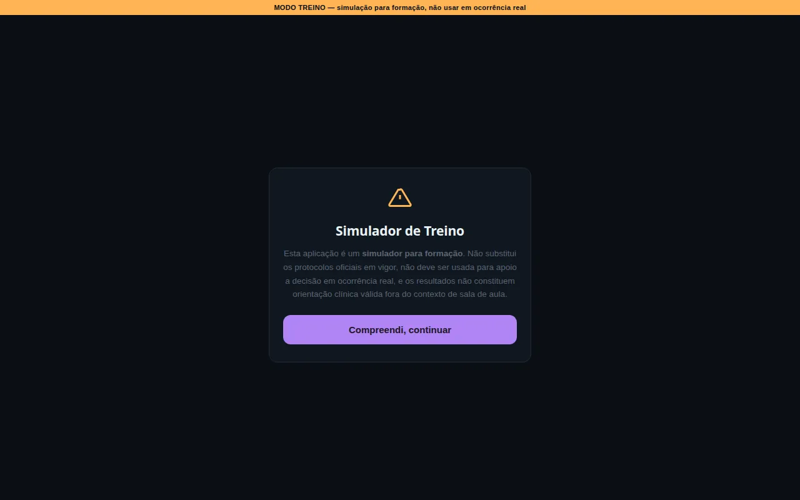 | 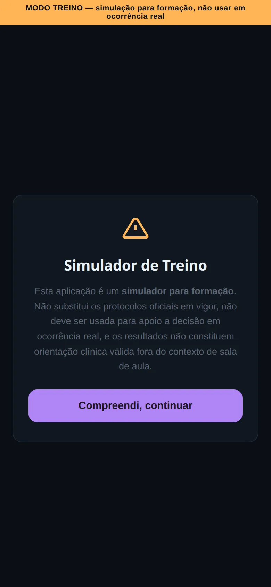 |
| **Lista de casos** | 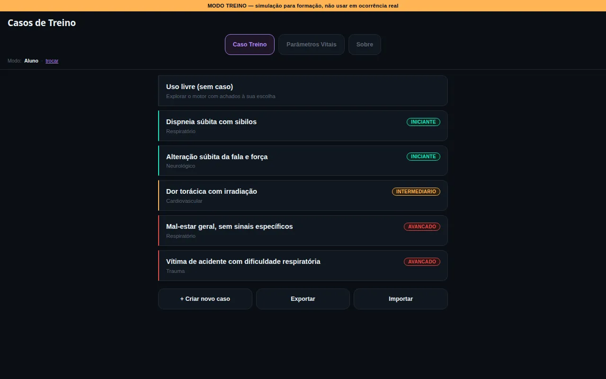 | 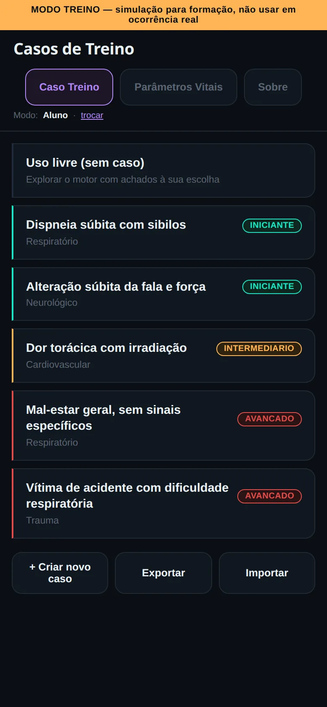 |
| **Avaliação a meio** | 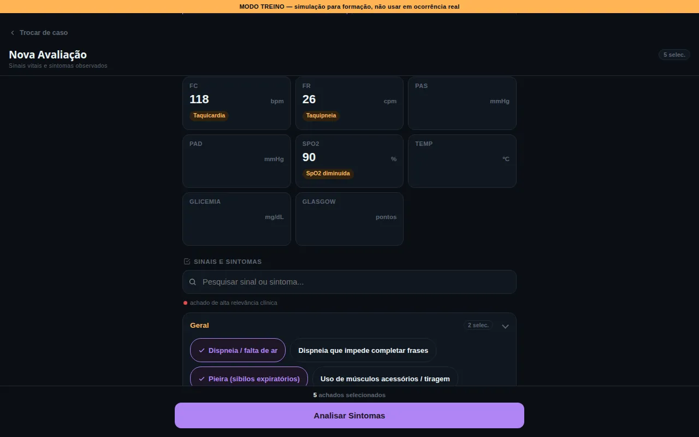 | 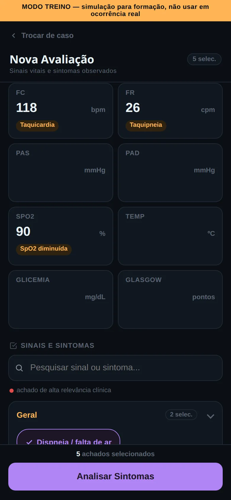 |
| **Resultado da triagem** | 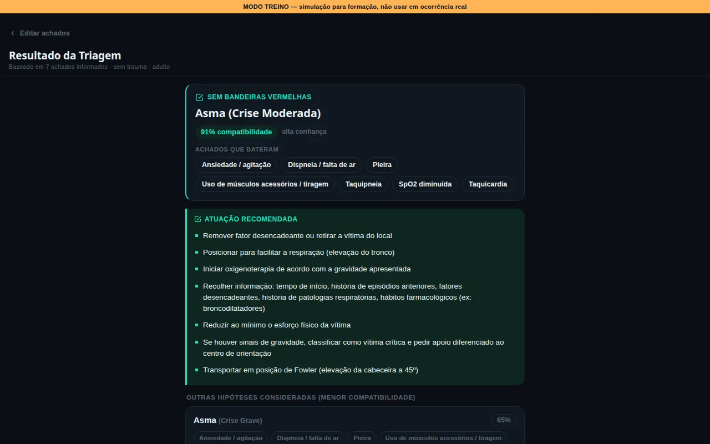 | 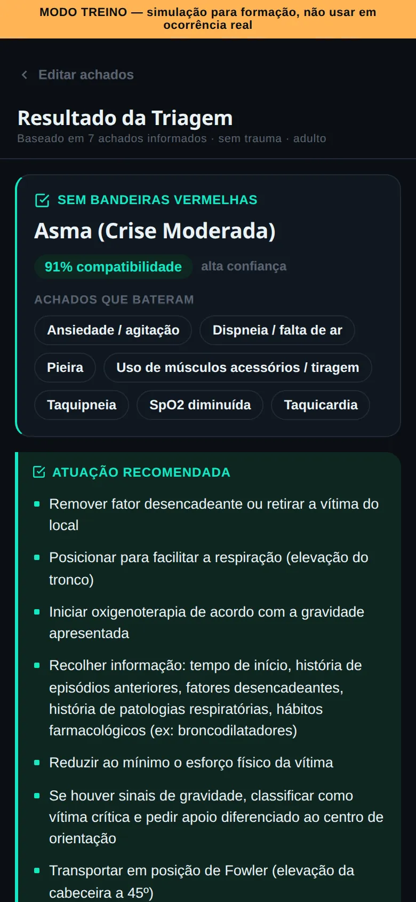 |
| **Parâmetros Vitais (5 anos)** | 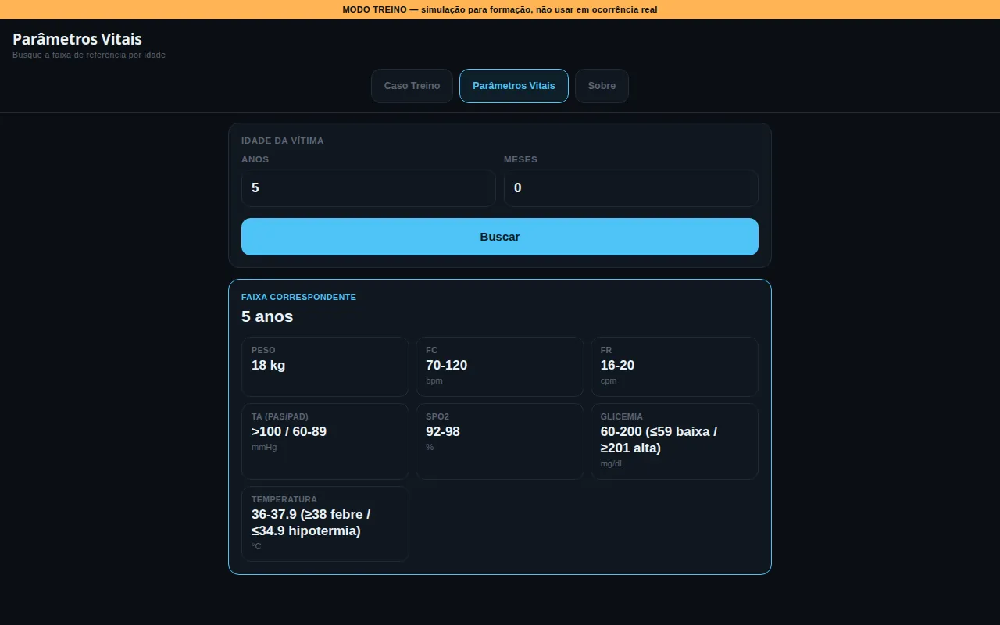 | 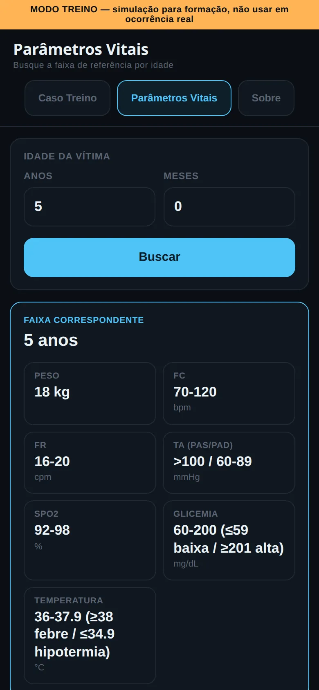 |

## Funcionalidades

**Caso Treino**
- **5 casos de treino incluídos** (2 de nível iniciante, 1 intermédio e 2 avançados, um deles propositadamente ambíguo), cada um com cenário escrito e gabarito.
- **Caso livre:** permite avaliar uma vítima sem cenário pré-definido.
- **Registo de 8 sinais vitais** (FC, FR, PAS, PAD, SpO2, temperatura, glicemia e Glasgow). Cada valor é traduzido de imediato num achado (por exemplo, "Taquicardia"), para o formando ver como o valor foi interpretado.
- **107 sinais e sintomas** organizados por grupos, com pesquisa sem acentos e destaque para os achados de alta relevância clínica.
- **Contexto da vítima:** os interruptores "trauma / sem trauma" e "adulto / pediátrico" decidem que fichas entram na análise.
- **Resultado com ranking** de até 4 hipóteses. Cada uma mostra a percentagem de compatibilidade, os achados que bateram e a indicação de bandeiras vermelhas.
- **Aviso de empate:** quando as hipóteses estão demasiado próximas, o simulador não escolhe uma e diz que faltam achados para diferenciar.
- **Atuação recomendada** para a hipótese destacada, com 47 planos de atuação, um por ficha.

**Modo instrutor**
- **Ver gabarito e preencher o formulário com os dados esperados** de cada caso.
- **Comparação automática** entre o resultado do motor e o gabarito do caso.
- **Editor de casos:** permite criar casos com resposta definida ou ambíguos (com vários candidatos válidos).
- **Exportar e importar** os casos criados em ficheiro JSON, para os partilhar entre computadores.

**Parâmetros Vitais**
- **Pesquisa por idade (anos + meses)** que devolve a faixa de referência correspondente: peso, FC, FR, TA, SpO2, glicemia e temperatura. São 12 faixas, do recém-nascido ao adulto.

## Como funciona o motor de pontuação

O motor está em [`motor_pontuacao.py`](motor_pontuacao.py) e foi replicado em JavaScript no `index.html`, com as mesmas constantes e a mesma lógica. A página corre no browser, e o script Python serve para testar e afinar o motor com casos de exemplo.

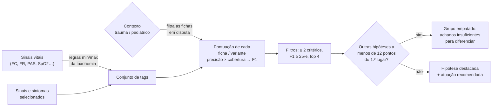

### 1. Dos dados da vítima às tags
Tudo o que o motor compara é uma **tag** (por exemplo, `dispneia`, `taquicardia`). Os sinais e sintomas já são tags. Os sinais vitais são convertidos pelas regras de [`taxonomia.json`](taxonomia.json), que tem 14 regras para 8 parâmetros. Cada regra tem um mínimo e/ou um máximo: FC ≥ 101 bpm ativa `taquicardia`, SpO2 abaixo do limite ativa `spo2_baixo`, e assim por diante.

### 2. Cada ficha tem critérios com peso
Em [`criterios.json`](criterios.json) há **47 fichas** em 10 categorias. Cada critério é uma tag com **peso de 1 a 3**. Algumas fichas dividem-se em variantes que disputam o ranking como se fossem fichas separadas:
- 33 fichas simples;
- 7 divididas **por gravidade** (ex.: asma ligeira / moderada / grave);
- 7 divididas **por subtipo** (ex.: as lesões do trauma torácico, as síndromes tóxicas).

No total entram na disputa **79 variantes**.

### 3. Porquê F1 e não uma percentagem simples
Uma percentagem do tipo "quantos critérios desta ficha bateram" favorece fichas com poucos critérios. O motor calcula duas métricas e combina-as:

- **Precisão:** do peso total dos critérios da ficha, quanto bateu. Responde à pergunta: "o que a vítima apresenta é compatível com esta ficha?"
- **Cobertura:** das tags que o formando registou, quantas a ficha explica. Responde à pergunta: "esta ficha dá conta de tudo o que foi observado?"
- **F1:** a média harmónica das duas, `2 × P × C / (P + C)`. Só é alta quando as duas métricas são altas.

Exemplo real, o caso da captura de ecrã acima, com 7 tags: `dispneia`, `pieira`, `tiragem_musculos_acessorios`, `ansiedade`, `taquicardia`, `taquipneia`, `spo2_baixo`.

| Variante | Precisão | Cobertura | F1 |
|---|---|---|---|
| Asma — crise moderada | 83% | 100% | **91%** |
| Asma — crise grave | 53% | 86% | 65% |
| Asma — crise ligeira | 100% | 29% | 44% |

A crise ligeira bate 100% dos seus critérios, mas só explica 2 das 7 tags registadas. Com uma percentagem simples ficaria em primeiro lugar. Com F1, fica em terceiro.

### 4. Bónus das bandeiras vermelhas
Os critérios marcados como `bandeira_vermelha` (65 no total) têm o peso **multiplicado por 2** (`BONUS_BANDEIRA = 2`). Assim, um sinal de gravidade pesa mais na precisão do que um achado comum, e a sua ausência também penaliza mais.

### 5. Portões de contexto
As fichas da categoria **Trauma** só entram na disputa com mecanismo de trauma confirmado, e as de **Pediatria** só com vítima pediátrica. Sem estes portões, sinais genéricos de choque (taquicardia, palidez) punham, por exemplo, um hemotórax a competir com quadros puramente clínicos.

### 6. Limiar de diferenciação
Depois de ordenar por F1, o motor descarta as variantes com menos de 2 critérios batidos ou F1 abaixo de 25%, e fica com as 4 melhores. Se alguma estiver a **menos de 12 pontos percentuais** do 1.º lugar (`LIMIAR_DIFERENCIACAO_PONTOS = 12`), nenhuma é destacada: o resultado mostra o grupo empatado e sugere investigar mais achados antes de decidir a conduta.

## Arquitetura e tecnologias

- **HTML, CSS e JavaScript puros**, sem frameworks, sem dependências e sem passo de build.
- **Dados em JSON:** taxonomia, critérios, atuações, casos e parâmetros vitais.
- **Python 3** (só a biblioteca padrão) para o motor de pontuação e os cenários de teste.
- **GitHub Pages** para a publicação.

```
simulador-triagem/
├── index.html               # Caso Treino: interface + motor de pontuação em JS
├── parametros_vitais.html   # Pesquisa de parâmetros vitais por idade
├── estilo.css               # Estilos partilhados pelas duas páginas
├── taxonomia.json           # Tags: 107 sinais/sintomas + 14 regras de sinais vitais
├── criterios.json           # 47 fichas com critérios, pesos e bandeiras vermelhas
├── atuacoes.json            # Atuação recomendada para cada uma das 47 fichas
├── casos_ficticios.json     # 5 casos de treino com cenário e gabarito
├── parametros_vitais.json   # 12 faixas etárias de referência
├── motor_pontuacao.py       # Motor de pontuação em Python + 4 cenários de exemplo
├── demo_score_teste.py      # Versão inicial do motor, com a amostra de teste
├── taxonomia_teste.json     # Amostra inicial (4 fichas) usada pelo demo
├── criterios_teste.json     #   "
├── docs/screenshots/        # Capturas de ecrã deste README
├── wireframe/               # Protótipos de design (não usados pela aplicação)
└── LICENSE                  # Licença MIT
```

O `index.html` traz os dados de `taxonomia.json`, `criterios.json`, `atuacoes.json` e `casos_ficticios.json` embutidos em blocos `<script type="application/json">`. Por isso o Caso Treino não precisa de pedidos de rede. O `parametros_vitais.html` vai buscar o `parametros_vitais.json` com `fetch`.

## Como executar localmente

```bash
git clone https://github.com/rolimjeferson26-cyber/simulador-triagem.git
cd simulador-triagem
python3 -m http.server 8000
```

Depois abre <http://localhost:8000> no browser.

**Porque não basta abrir o ficheiro com duplo clique (`file://`):** a página de Parâmetros Vitais carrega os dados com `fetch('parametros_vitais.json')`, e os browsers bloqueiam pedidos `fetch` a ficheiros locais abertos por `file://`. O Caso Treino funciona por `file://`, porque tem os dados embutidos. Ainda assim, usar sempre o servidor local evita surpresas.

Para correr os cenários de exemplo do motor em Python:

```bash
python3 motor_pontuacao.py
```

## Dados e fontes

- As fichas, critérios e atuações foram anotados a partir das fichas de consulta do projeto [Guia de Emergências](https://github.com/rolimjeferson26-cyber/guia-emergencias). O campo `fonte` desse projeto descreve-as como *"compiladas a partir de conhecimento clínico geral (…) amplamente reconhecido na literatura de emergência médica"*, e não como reprodução de nenhum manual ou entidade formadora.
- Os **pesos (1–3) e as bandeiras vermelhas** foram atribuídos por julgamento clínico durante a anotação, e não por cálculo estatístico. O próprio `taxonomia.json` regista isto no campo `limitacoes`.
- A tabela de **parâmetros vitais por idade** foi extraída da ficha "Abordagem e Avaliação da Vítima Pediátrica" do Guia de Emergências, com os valores iguais.
- Todo o conteúdo está em ficheiros JSON separados do código, o que permite revê-lo ou corrigi-lo sem mexer na lógica.

## Limitações conhecidas

- **As regras de sinais vitais estão calibradas para adultos, mesmo com o contexto pediátrico ativo.** Esta é a limitação mais importante. O contexto pediátrico só decide que fichas entram na disputa: os limites que transformam valores em tags continuam a ser de adulto (FC ≥ 101 → taquicardia, FR ≥ 21 → taquipneia, PAS ≤ 89 → hipotensão). Por exemplo, um bebé de 6 meses com FC 140, FR 30 e PAS 80 está dentro da faixa de referência da tabela de Parâmetros Vitais (FC 90-180, FR 30, PAS > 70). Mesmo assim, o motor marca **taquicardia, taquipneia e hipotensão**, e esses achados falsos puxam o ranking para quadros de gravidade como choque ou sépsis. A interface avisa disto, mas a correção tem de ser feita no motor (ver *Próximos passos*).
- **O modo instrutor não é uma proteção real.** A verificação do código de acesso é feita no browser, e a escolha de modo fica guardada no `localStorage`. Serve para separar as vistas de formando e de formador em aula, mas não controla acessos.
- **Os casos criados pelo formador ficam só no browser onde foram criados** (`localStorage`). Para os passar para outro computador é preciso exportá-los e importá-los em JSON. Limpar os dados do browser apaga-os.
- **Os pesos dos critérios não foram validados estatisticamente**, como descrito em *Dados e fontes*.
- **Os dados existem em duplicado:** os ficheiros JSON e as cópias embutidas no `index.html`. Hoje, uma alteração num JSON tem de ser copiada à mão para o HTML.
- **Não há testes automatizados.** Os scripts Python correm cenários de exemplo e imprimem o ranking para revisão manual, mas não têm verificações (`assert`) nem integração contínua.
- **Há apenas 5 casos incluídos.** O resto do treino depende de casos criados pelo formador ou do caso livre.

## Próximos passos

Por ordem de prioridade, a partir das limitações acima:

1. **Faixas de sinais vitais pediátricas no motor:** usar a tabela de [`parametros_vitais.json`](parametros_vitais.json) para escolher os limites de cada tag conforme a idade da vítima, em vez dos limites fixos de adulto.
2. **Testes automatizados com `assert`**, criados a partir dos cenários de exemplo que já existem em `motor_pontuacao.py` e `demo_score_teste.py`.
3. **Acabar com os JSON duplicados dentro do HTML**, para cada conjunto de dados ter uma única fonte.
4. **Mais casos de treino**, de várias categorias e níveis de dificuldade.

## Projeto relacionado

**[Guia de Emergências](https://rolimjeferson26-cyber.github.io/guia-emergencias)**: guia de consulta rápida com 68 fichas de emergências médicas e de trauma, e anatomia interativa dos 11 sistemas do corpo humano. As fichas do simulador foram anotadas a partir dele. ([repositório](https://github.com/rolimjeferson26-cyber/guia-emergencias))

## Autor

**Jeferson Rolim**, Bombeiro EIP
- GitHub: [@rolimjeferson26-cyber](https://github.com/rolimjeferson26-cyber)
- LinkedIn: em breve

## Licença

O código deste projeto está disponível sob a [licença MIT](LICENSE).

A licença cobre o código. Os conteúdos clínicos (fichas, critérios, atuações, casos e valores de referência) são material educativo e não substituem os protocolos oficiais em vigor nem a formação certificada.
